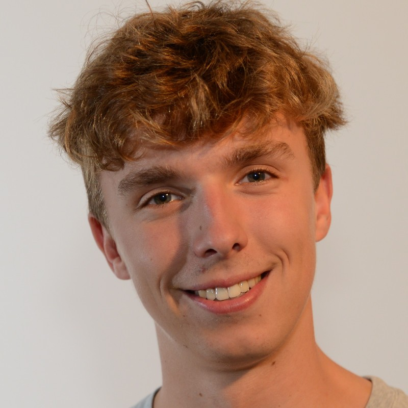
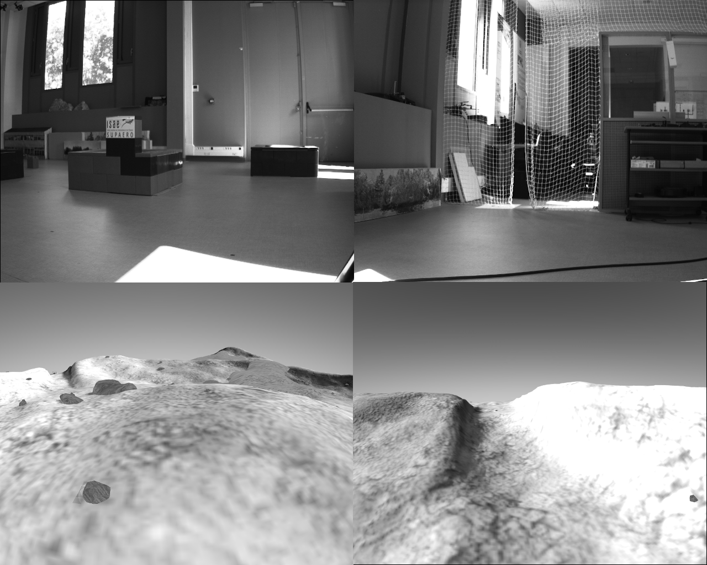
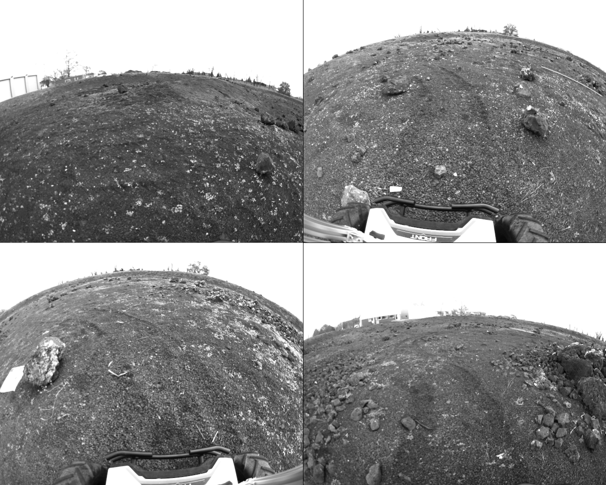
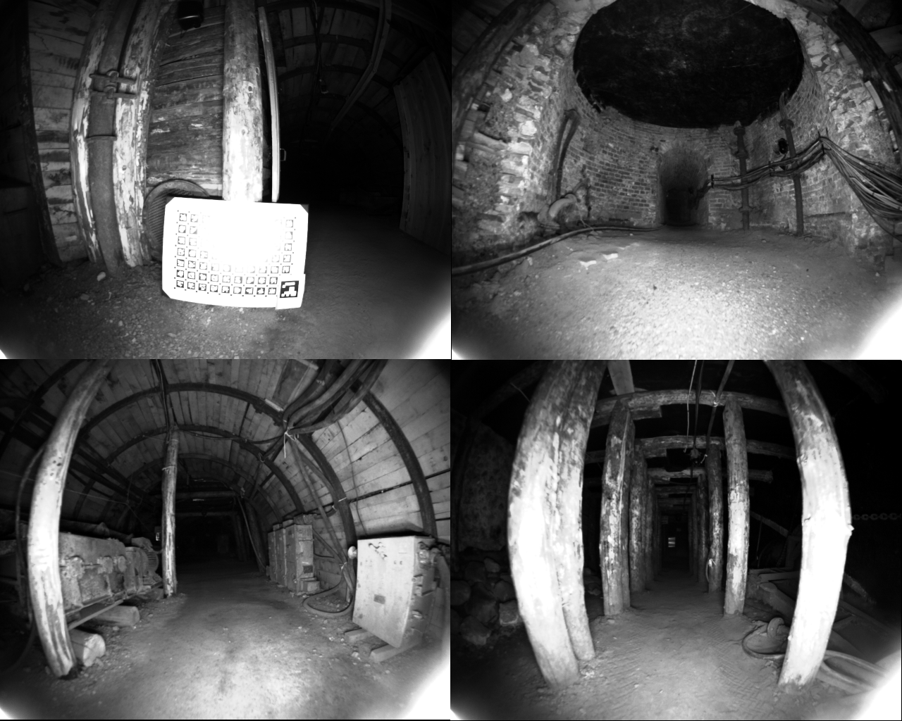

  

    
  

  

    Post Doctoral Researcher @ ISAE-SUPAERO
    
<strong>Email:</strong> cesar.debeunne@isae-supaero.fr 

    <a href="https://github.com/cdebeunne/cdebeunne.github.io/raw/main/doc/CV_debeunneAnglais.pdf" download>Resume</a> - <a href="https://scholar.google.com/citations?user=tR3VY9IAAAAJ&hl=fr">Scholar</a> - <a href="https://github.com/cdebeunne">Github</a> - <a href="https://hal.science/tel-04960044v2/document"> Thesis</a>
  

 

I am a post doc researcher at ISAE-SUPAERO. I am currently working on state-estimation for ground robotics, mostly focusing on Visual Sensors. I have done my PhD under Damien Vivet's supervision on Visual Navigation for Lava Tubes exploration. 

# Publications 📚

## Journal Papers

- **César Debeunne, Damien Vivet.** "A review of visual-LiDAR fusion based simultaneous localization and mapping." In: *Sensors.* Vol. 20, 7, 2020. [[paper](https://www.mdpi.com/1424-8220/20/7/2068)]

    

- **César Debeunne, Alex Torres, Damien Vivet.** "SaDVIO: Sparsify and Densify VIO for UGV Traversability Estimation." In: *IEEE Robotics and Automation Letters.* Vol. 9, 10, 2024. [[paper](https://hal.science/hal-04639114/),[video](https://www.youtube.com/watch?v=hTFDDV5-x-E),[code](https://github.com/ISAE-PNX/SaDVIO)]

    

## International Conference Papers

- **César Debeunne, Damien Vivet, Alex Torres.** "Design of a bi-monocular Visual Odometry System for Lava Tubes exploration." In: *PNARUDE Workshop IEEE/RSJ International Conference on Intelligent Robots and Systems.* 2022. [[paper](https://hal.science/hal-03765955/file/WorkshopPNARUDE_debeunne_v2.pdf),[video](https://www.youtube.com/watch?v=HrWcfajexco)]

    

- **César Debeunne, Joan Vallvé, Alex Torres, Damien Vivet.** "Fast bi-monocular Visual Odometry using Factor Graph Sparsification." In: *IEEE/RSJ International Conference on Intelligent Robots and Systems.* 2023. [[paper](https://hal.science/hal-04185948/),[video](https://www.youtube.com/watch?v=bPdZfVaJMLM)]

    

- **César Debeunne, Damien Vivet, Alex Torres.** "Non-Recovering Field-of-View Imaging-Based SLAM for Lava Tubes Exploration." In: *17th Symposium on Advanced Space Technologies in Robotics and Automation.* 2023. [[paper](https://hal.science/hal-04248151v1/file/ASTRA___Non_recovering_FoV.pdf),[video](https://youtu.be/TW5_tfyVznA)]

    

## Unpublished

- **César Debeunne, Médéric Fourmy, Yann Labbé, Pierre-Alexandre Léziart, Guilhem Saurel, Joan Solà, Nicolas Mansard.** "CosySlam: investigating object-level SLAM for detecting locomotion surfaces." 2022 [[paper](https://hal.science/hal-03351438v2/document),[video](https://peertube.laas.fr/w/bJAcbvFo6ktg1U9dyU838T)]

    

# Code 💻

  

    

      
    

  

  

    

      
    

  

  

    

      
    

  

# Datasets 📦

- [Non Overlapping FoV](https://doi.org/10.34849/SEVFJB)

    

- [Martian Dataset](https://doi.org/10.34849/DGLZPE)

    

- [Mine Museum Dataset](https://doi.org/10.34849/IV45CZ)

    

